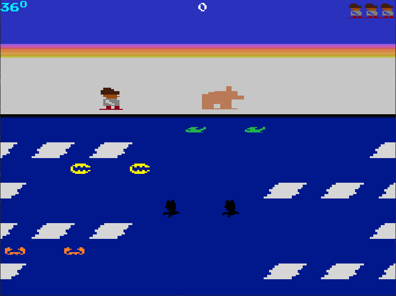

# About
This is a `Frostbite Atari 2600` game clone coded in `C++ (ISO C++ 17 Standard)` and `SFML 2.5.1` library. No `OpenGL` and or frameworks built ontop of SFML were used for this project. The game code can be easily scaled up to include levels. External contributions are welcome. Cheeers :smiley:!

## Software Development Practices

- `Agile Development (3 iterations)`
- `Object Oriented Programming`
- `Scalable Code`
- `Data Encapsulation`

## Main Menu
Interface contains a main menu where player can navigate between player modes, see game instructions and quit game. Use `Arrow keys` to navigate the main menu and press `Enter` to make a selection.

## Controls and Instructions

Uses `WSAD` convention

Single player
- `W` Jump up
- `S` Jump down
- `A` Move left
- `D` Move right
- `Left Shift` Reverse a block of ice

The second player uses the `arrow keys` to move Frostbite and `space` to reverse a block of ice. Press `ESC` to jump out of gameplay screen. 

## Single Player Mode

## Multiplayer Mode

# How to Run Game
`Windows`: Under releases (V3.0), download the executables folder. Unzip the file and run the `Frostbite.exe` file.

`Linux`: Download and unzip the "executables-Linux.zip" and run the frostbite "executable" under releases.

# Building from source code
Windows: You will need to download SFML library and do the required IDE setup.
Linux: Install sfml libraries in the default folder and run the Makefile.
