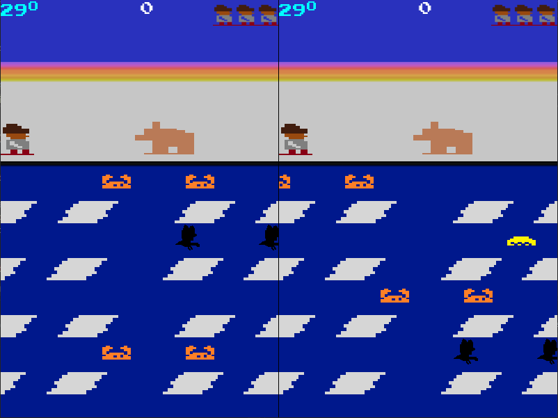

# About
This is a `Frostbite Atari 2600` game clone coded in `C++ (ISO C++ 20 Standard)` and `SFML 2.5.1` library. No `OpenGL` and or frameworks built ontop of SFML were used for this project. The following `additional` functionality was added ontop of the original game:

- `Multiplayer mode`
- `Ice Reversal` 

## Software Development Practices

- `Agile Development (2 iterations)`
- `Object Oriented Programming`
- `Scalable Code`
- `Data Encapsulation`

## Main Menu
Interface contains a main menu where player can navigate between player modes, see game instructions and quit game. Use `Arrow keys` to navigate the main menu and press `Enter` to make a selection.

## Controls and Instructions

Uses `WSAD` conention

Single player
- `W` Jump up
- `S` Jump down
- `A` Move left
- `D` Move right
- `Left Shift` Reverse a block of ice

The second player uses the `arrow keys` to move Frostbite and `space` to reverse a block of ice.

## Single Player Mode

## Multiplayer Mode

# How to Run Game
Click on release link `(on the right)` and download `executables.zip` folder under the latest release. Unzip the file and run the `Frostbite.exe`.

Alternatively, you can download the `Source code` zip folder. This method will require an IDE setup.
